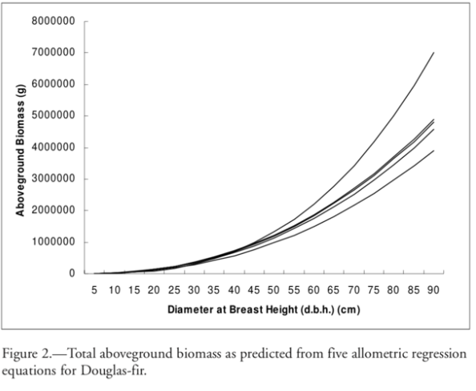

The purpose of this exercise is to acquaint you with the application of allometric equations for estimating forest carbon based on tree diameter measurements. You will use tree dbh data similar to what you collected during the second field trip. The data are provided in three files -- one for each plot. The calculations can be readily performed in Excel or R (R script provided). To estimate the amount of tree carbon in your plots, you need to do the following:

```{r setup, include=FALSE}
knitr::opts_chunk$set(echo = TRUE, warning = FALSE, message = FALSE)
```

#### Load packages

```{r}
library(readxl)
library(tidyverse)
library(kableExtra)
library(ggplot2)
install.packages("formattable")
library(formattable)
```

#### Read in plot xlsx data for each plot

```{r}
#Read in plot xlsx data for each plot
p1<-read.csv("data/Plot1.csv", header=T)
head(p1)
p2<-read.csv("data/Plot2.csv", header=T)
head(p2)
p3<-read.csv("data/Plot3.csv", header=T)
head(p3)
```

The `data`folder contains data from 2022, 2023, and 2024. If you want to explore other years of data, you can load them in using `read.csv("data/name_of_csv.csv", header = TRUE)`.

To estimate the amount of tree carbon in your plots, you need to do the following: \*Double-check dbh data for consistency in data formatting for the 3 plots.

## 1) For each plot, calculate the total aboveground biomass of each tree. Apply the equation from table 1 in Jenkins et al. (2004), assuming that the allometric parameters for Quercus douglasii and Q. agrifolia are equivalent to those for "juniper/oak/mesquite.

$$bm = \exp(\beta_0 + \beta_1 \times \ln(dbh))$$

Where

-   bm = total aboveground biomass
-   $$exp$$ = exponential function
-   $$beta_0$$ = -0.7152
-   $$beta_1$$= 1.7029
-   $$ln(dbh)$$ = natural log base e of the diameter at breast height of the tree.

*Note: How do you handle multiple-trunked oaks? Calculate the total basal area by summing the calculated area of each trunk. Then calculate the equivalent DBH for a single-trunked tree with the same area. This has been done already in the data, but want you to take note of this.*

```{r}
#parameters for Jenkins:
b0_j<--0.7152
b1_j<-1.7029
```

#### Calculate aboveground biomass per tree (log is ln in R)

```{r}
p1$bm_jenkins<-exp(b0_j+b1_j*log(p1$dbh))
```

Repeat this for plot 2 and 3, and make a table of results

```{r}

```

## 2) For comparison, produce an alternative estimate of aboveground tree biomass for each tree using equation 7 provided in Table 2 from Karlik and Chojnacky (2014).

$$bm = \beta_1 \times dbh^{\beta_2}$$

Where bm = total aboveground biomass, $\beta_1$ = 0.068, $\beta_2$ = 2.569, dbh = diameter at breast height of the tree.

```{r}
#paramters for KC:
b1_kc<-0.068
b2_kc<-2.569
```

#### Calculate aboveground biomass per tree

```{r}
p1$bm_kc<-b1_kc*(p1$dbh^b2_kc)
```

Repeat this for plot 2 and 3, and make a table of results

```{r}

```

## 3) Plot the dbh-biomass relationships for your different equations as illustrated in Jenkins et al. (2004), Figure 2 (pasted below). This will provide some sense of estimation uncertainty.



## 4) Based on the parameters from equation 7, Table 2, in Karlik and Chojnacky (2014), estimate the total tree biomass per plot by summing the biomass for all trees in the plots, and dividing by the total plot area (50m x 25m = 1250m2). Convert your estimate to tree carbon per hectare (see top of page 230 in Karlik and Chojnacky (2014), estimate of 45.85% of biomass is carbon, so $(bm*0.4585)/(1250m^2*0.0001)$ to get carbon per hectare).

```{r}
#Biomass and carbon:
totalplotarea<-(50*25)*0.0001 #50 meter by 25 meter, converted to hectares
carboncontent<-.4585 #The carbon content of branch/stem material combined ranged from 45.06% to 46.70%, with a mean of 45.85% (SE 0.276%); mean can be used to convert biomass to carbon storage

#Calculate aboveground biomass per plot for Karlik_Chojnacky
p1_bm_kc<-sum(p1$bm_kc)

```

Repeat this for plot 2 and 3 and turn into a table of results; then calculate biomass per plot per square meter based on total size of the plot

```{r}
#Convert estimate to tree carbon per hectare (hint: use 'carboncontent' variable to convert biomass estimates to carbon; then use 'totalplotarea' in hectares variable to convert to carbon per hectare) #make a table of the output

```

## 5) Briefly discuss the major sources of uncertainty and error in your estimate of carbon in blue oak woodlands at Sedgwick Reserve, and how you might reduce the uncertainty in that estimate.

**Your answer here.**
